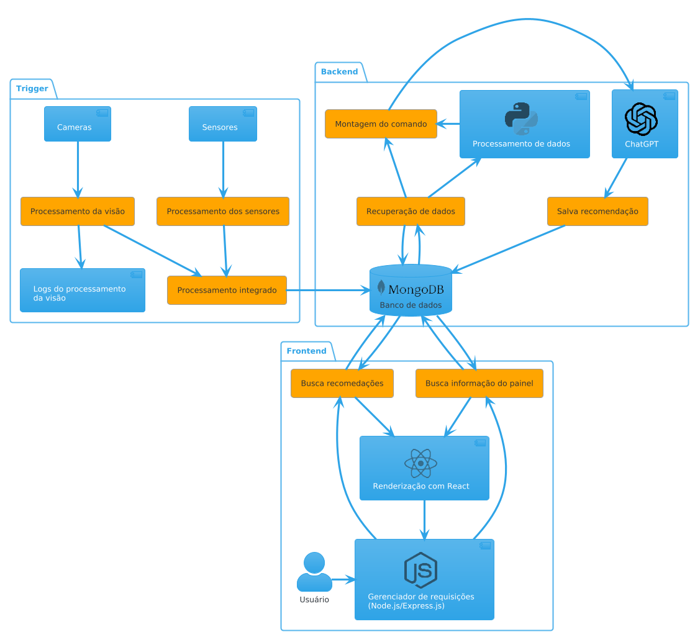

## Aviso
> Este projeto foi desenvolvido como parte integrante das atividades e avaliações da disciplina 'Projetos em Engenharia de Computação', oferecida pela Universidade Federal de São Paulo (UNIFESP), não havendo, portanto, o compromisso de apresentar plena funcionalidade, uma vez que seu desenvolvimento teve como objetivo principal o cumprimento dos requisitos acadêmicos da referida disciplina.

## Motivação
- Paradas não planejadas impactam cerca de 20 a 30% da produtividade das indústrias Brasileiras, afetando sua competitividade (deloitte, 2019).
- Desafios da Indústria 4.0: eficiência, segurança e sustentabilidade;
- Problema central: falhas e paradas não planejadas aumentam custos e reduzem eficiência operacional;
- Necessidade: Decisões rápidas, inteligentes e contextualizadas em tempo real;
- ODSs relacionadas ao projeto ODS 9 (Indústria, Inovação e Infraestrutura) e ODS 12 (Consumo e Produção Responsáveis)

## Objetivo
O objetivo do projeto é construir um sistema cognitivo para tomada de decisão em processos industriais utilizando múltiplos agentes inteligentes com o intuito de reduzir paradas não planejadas na linha de produção industrial, como isso o sistema deve ser capaz de prever problemas com base em dados históricos e sugerir manutenções preventivas visando maior estabilidade e qualidade.

## Arquitetura do Software
### Fluxograma resumido da arquitetura

### Principais tecnologias
- Node.Js
- Python
- MongoDB
- OpenAI ChatGPT API
- React

## Desenvolvimento e Implementação
O planejamento para o desenvolvimento do projeto teve como base a construção de um MVP (sigla do inglês para Produto Mínimo Viável) para resolver parte dos problemas listados acima e o "Design Centrado no Usuário" que foi utilizado para definir melhor as telas com enfase na análise da Jornada do Usuário que se mostrou uma solução interessante para obtermos dados relevantes a respeito das múltiplas camadas de usuários, visto que foi possível compreender o comportamento dos operadores de produção, da equipe de manutenção e da gestão, entendendo melhor o como organizar os dados e como entregar os dados necessários para cada um dos diferentes grupos de usuários.
### Tela de Visão Geral
Tem como objetivo mostrar diversos parâmetros da operação.

### Tela de Sugestão
Tem como objetivo mostrar as sugestões geradas pela detecção e processamento dos múltiplos agentes, o principal usuário dessa tela é a equipe de manutenção.

O projeto desenvolvido nessa disciplina utilizou como base um agente já existente, fornecido pelo gestor do projeto, para detectar através de processamento de video a qualidade de uma peça na linha de produção, ao sair de uma maquina do processo, e disponibilizar essa informação dentro de um banco de dados, a partir disso e de outras informações da maquina como o histórico de manutenção organizamos os dados, buscando padrões, utilizamos a tecnologia RAG e com o auxilio da "OpenAI ChatGPT API" podemos montar sugestões minimamente coerentes para o cenário em estudo, dessa forma obtendo uma versão básica porém funcional do "Sistema Cognitivo para Tomada de Decisão em Processos Industriais com Agentes Inteligentes".

## Estrutura do Código e Principais Componentes
Dentro do [repositório do projeto]({{ site.github.repository_url }}) existem diversos arquivos de documentação que podem ajudar a compreender o funcionamento do código.

## Gestão do Projeto
### Planejamento
Inicialmente o projeto foi separado em 4 sprints (0-3)
- Sprint 0: Planamento e pré-projeto (Definir escopo do projeto e organizar plataformas de gerenciamento de código e tarefas)
- Sprint 1: Protótipos iniciais (Modelar dados, preparar inserção e construir consultas básicas no banco de dados; Planejar e desenvolver as base das interfaces para os usuários; Planejamento e construção inicial do RAG e do agente cognitivo responsável pelas recomendações)
- Sprint 2: Integração dos módulos (Integração do agente cognitivo com o banco; Integração das interfaces de usuário com o banco)
- Sprint 3: Validações, Otimizações e entrega final
### Metodologia
- Metodologia Ágil (Scrum + Kanban)
- Sprints quinzenais com entregas incrementais
- Quadro Kanban utilizando a ferramenta online Asana
- Reuniões semanais e colaboração contínua através do WhatsApp e Google Meet
- Versionamento e integração (GitHub)

## Conclusões e Próximos Passos:
### Conclusões
Ao finalizar o projeto proposto para essa disciplina foi possível concluir que, mesmo em um escopo fechado e limitado, desenvolver uma solução utilizando inteligencia artificial para detectar padrões históricos e em tempo real com o objetivo de gerar ações ou sugestões de ações para reduzir os impactos gerados pela paradas não planejas e falha no controle de qualidade industrial é uma tarefa complicada e exige muito tempo no refinamento dos múltiplos agentes envolvidos, para que a detecção seja certeira e a ação realizada ou recomentada faça sentido com o contexto.
### Impacto social
O impacto social do projeto é indireto, mas estando relacionado com as ODSs 9 (Indústria, Inovação e Infraestrutura) e 12 (Consumo e Produção Responsáveis) temos que reduzir tempo de parada e aumentar a qualidade dos processos industriais implica em consumo e produção mais responsáveis.
### Próximos Passos
- Refinar os agentes de detecção
- Refinar o agente que sugestão
- Permitir que o sistema execute ações sugeridas de forma independente

## Membros e suas funções
- [Rafael Maciel](https://www.linkedin.com/in/rafael-s-maciel/): Gerenciamento do projeto
- Igor Pinkoff: Agente Cognitivo e Modelagem Cognitiva ([Rafael](https://www.linkedin.com/in/rafael-s-maciel/) - Supervisão/Orientação)
- Benjamim Nascimento: Backend e Dados ([Rafael](https://www.linkedin.com/in/rafael-s-maciel/) - Supervisão/Orientação)
- José Caldeira: Relatórios, Dashboard e Interface Visual ([Rafael](https://www.linkedin.com/in/rafael-s-maciel/) - Supervisão/Orientação)
- Gabriel Ribeiro: Relatórios, Dashboard e Interface Visual ([Rafael](https://www.linkedin.com/in/rafael-s-maciel/) - Supervisão/Orientação)

## Professores envolvidos
- Profª. Dra. Denise Stringhini (Docente responsável pela disciplina)
- Prof. Dr. Tiago de Oliveira (Docente responsável pela disciplina)
- Prof. Dr. Luiz Leduíno de Salles Neto (Orientador do [Rafael Maciel](https://www.linkedin.com/in/rafael-s-maciel/))